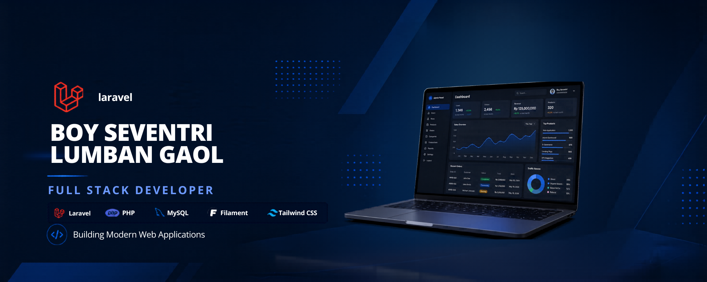

<h1 align="center">
  
</h1>

<h3 align="center">
  
  Laravel Developer | Full Stack Developer | Business Solutions Architect
  
</h3>

  
  
  
  

---

### 🚀 About Me

  

I'm a passionate **Full Stack Developer** specializing in **Laravel** and modern web technologies. With a strong focus on **Web Applications** and **Business Systems**, I help businesses transform their ideas into scalable digital solutions.

  

  
<strong>📌 More about me</strong>

- 🔭 Working on **advanced Laravel applications** and **enterprise business systems**
- 🌱 Learning **Livewire**, **Alpine.js**, and **Cloud Architecture**
- 👯 Looking to collaborate on **open-source Laravel packages**
- 💬 Ask me about **Laravel**, **PHP**, **MySQL**, **RESTful APIs**
- ⚡ Fun fact: **I love solving complex business problems with clean code**

---

### 🛠️ Tech Stack & Tools

  

<b>📦 Backend Development</b>

  
  
  
  

<b>🎨 Frontend Development</b>

  
  
  
  
  
  

<b>📱 Mobile Development</b>

  
  
  

<b>⚙️ Databases & DevOps</b>

  
  
  
  
  
  

---
### 🏆 Featured Projects

  <table>
    <tr>
      <td align="center" width="50%">
        <h3>🧺 Laundry POS</h3>
        
Complete laundry management system with order tracking, pricing, and reporting

        
        
        
      </td>
      <td align="center" width="50%">
        <h3>💈 Barbershop POS</h3>
        
Barbershop management with appointments, cashier, and employee tracking

        
        
        
      </td>
    </tr>
    <tr>
      <td align="center">
        <h3>🛒 POS Sembako</h3>
        
Retail POS with inventory tracking and sales reporting

        
        
        
      </td>
      <td align="center">
        <h3>🚌 TrayekSmart</h3>
        
Route optimization app using Dijkstra Algorithm

        
        
        
      </td>
    </tr>
    <tr>
      <td align="center">
        <h3>🆘 SOS App</h3>
        
Emergency response with real-time location sharing

        
        
        
      </td>
      <td align="center">
        <h3>📝 Survey App</h3>
        
Student satisfaction survey system with analytics

        
        
      </td>
    </tr>
  </table>

   
---

### 📊 GitHub Analytics

  
  

  
  

---

### 📌 GitHub Metrics

  

  
  
  

---

### ♟️ Play Chess Game

I've built an **interactive chess game** right on my profile! Try it out:

**Game Features:**
- ♟️ Full chess piece movements (Pawn, Rook, Knight, Bishop, Queen, King)
- ✅ Legal move validation
- 📝 Complete move history tracking
- ↩️ Undo functionality
- 🔄 Reset and start new games
- 🎨 Beautiful UI with real-time game status

---

### 🤝 Let's Connect

  
  
  
  
  

---

### 💬 Random Dev Quote

  

---

  

  <b><i>"Code is poetry. Build something beautiful today!"</i></b>

  
   
  

